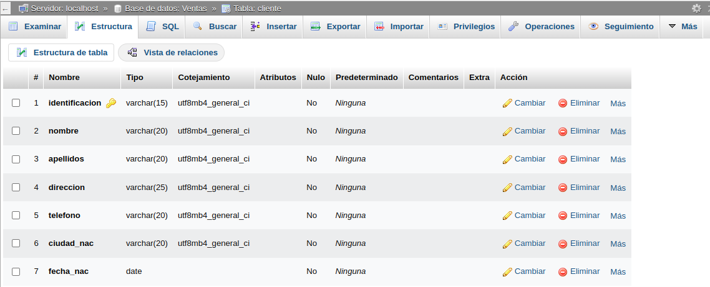
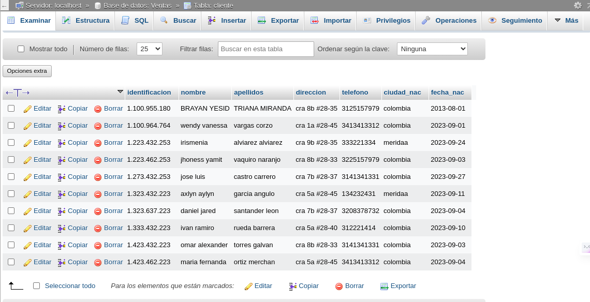

# IMTRODUCCION A SQL

1. Creacion de una base de datos (BD) con MySQL usando phpMyAdmin

## creacion tabla cliente
### DICCIONARIO DE DATOS
|campo|Tipo de dato|Longitud|
|-----|------------|--------|
|identificacion|varchar|15|
|nombre|varchar|20|
|apellidos|varchar|20|
|direccion|varchar|25|
|telefono|varchar|20|
|ciudad_nac|varchar|20|
|fecha_nac|date||

## Codigo SQL de creacion de la tabla cliente

``CREATE TABLE `Ventas`.`Cliente` (`identificacion` VARCHAR(15) NOT NULL , `nombre` VARCHAR(20) NOT NULL , `apellidos` VARCHAR(20) NOT NULL , `direccion` VARCHAR(25) NOT NULL , `telefono` VARCHAR(20) NOT NULL , `ciudad_nac` VARCHAR(20) NOT NULL , `fecha_nac` DATE NOT NULL , PRIMARY KEY (`identificacion`)) ENGINE = InnoDB;``

### Registro de datos en tabla cliente

#### codigo SQL de insercion de un registro a la tabla cliente

``INSERT INTO `cliente` (`identificacion`, `nombre`, `apellidos`, `direccion`, `telefono`, `ciudad_nac`, `fecha_nac`) VALUES ('1.100.955.180', 'BRAYAN YESID', 'TRIANA MIRANDA', 'cra 8b #28-35', '3125157979', 'colombia', '2013-08-01');``

### REGISTROS
